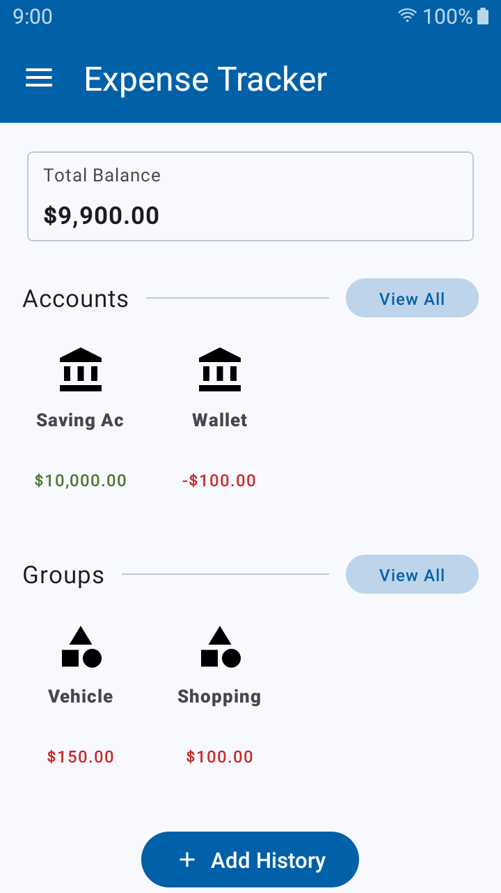
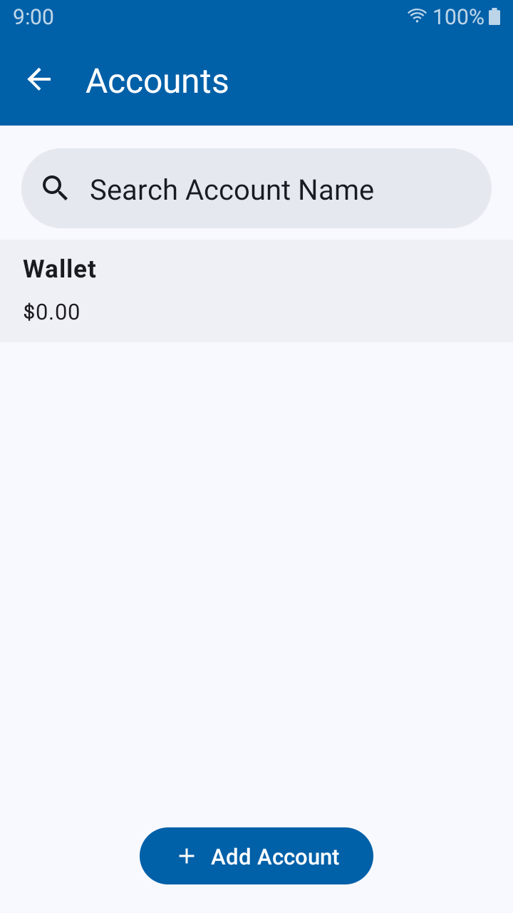
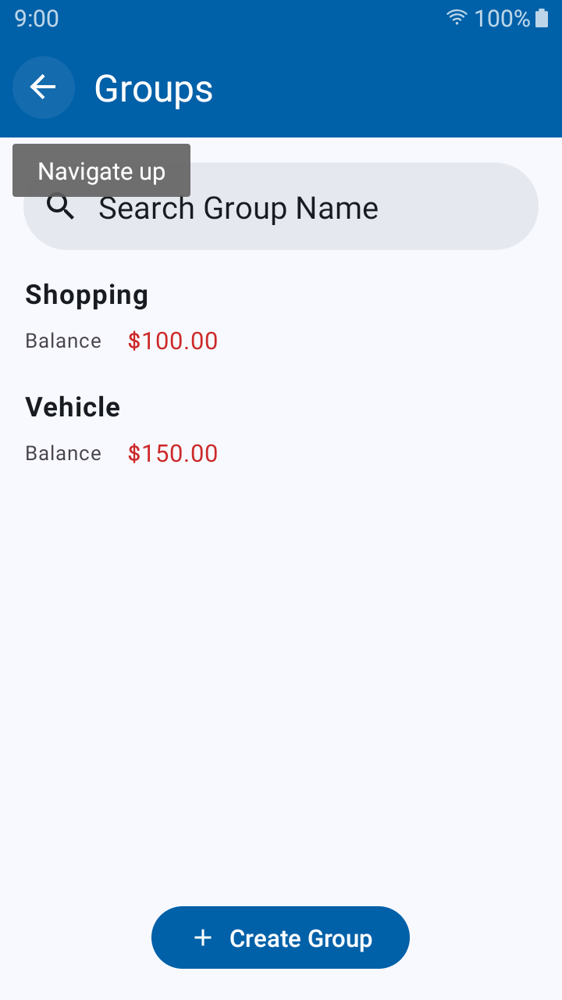
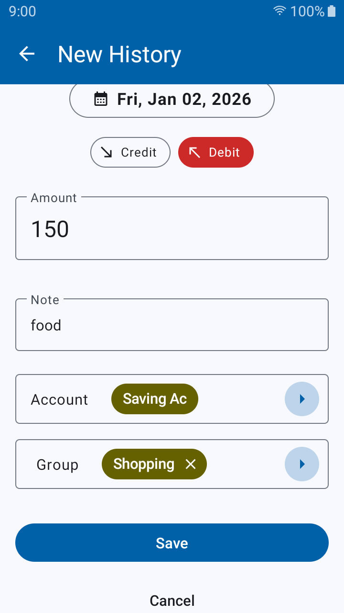
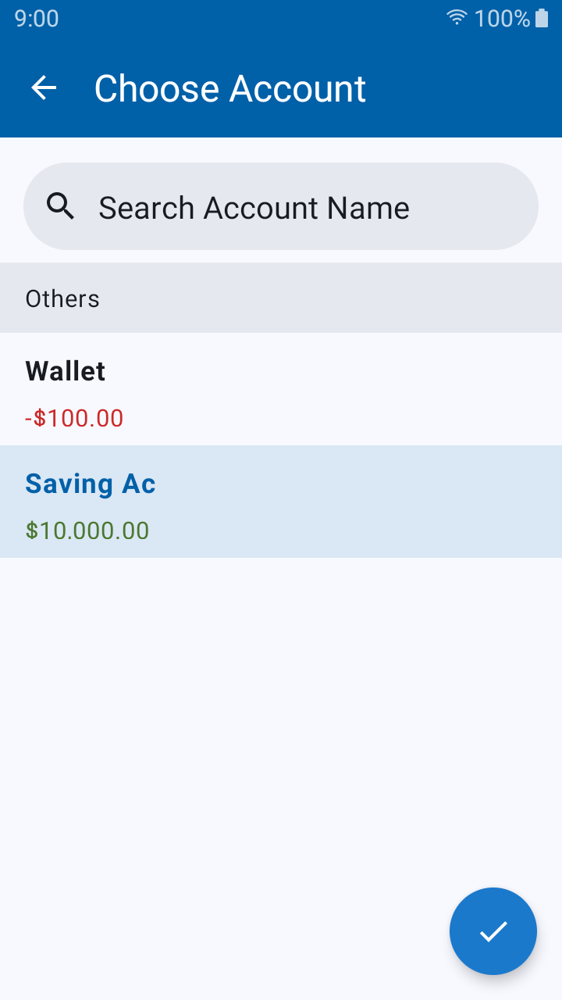
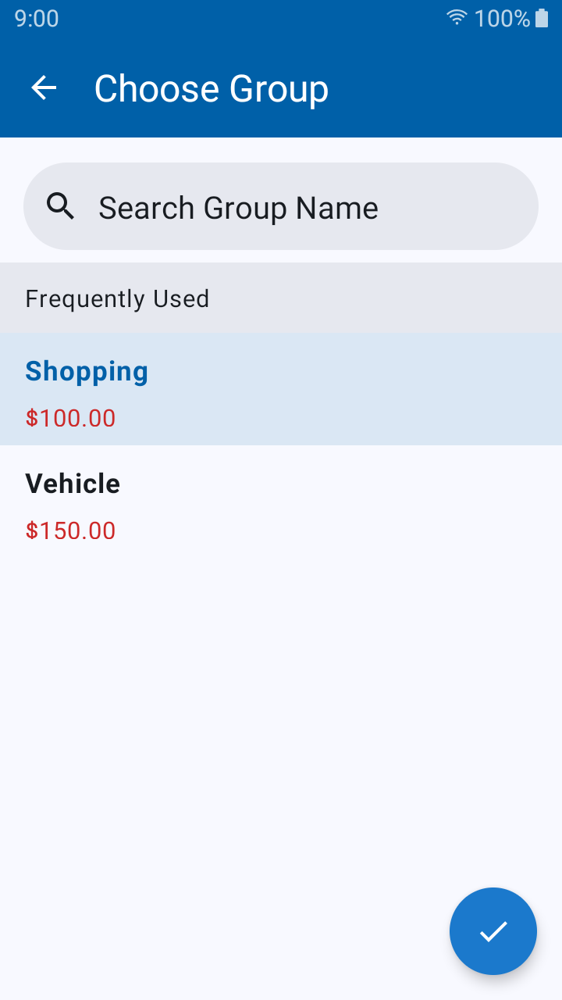
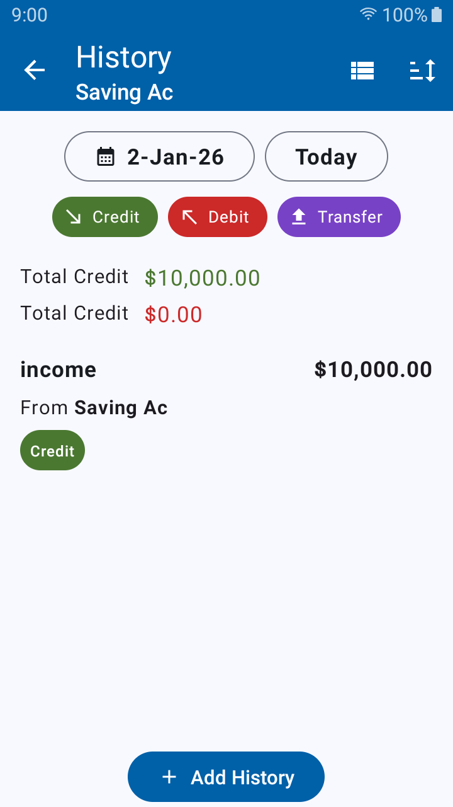
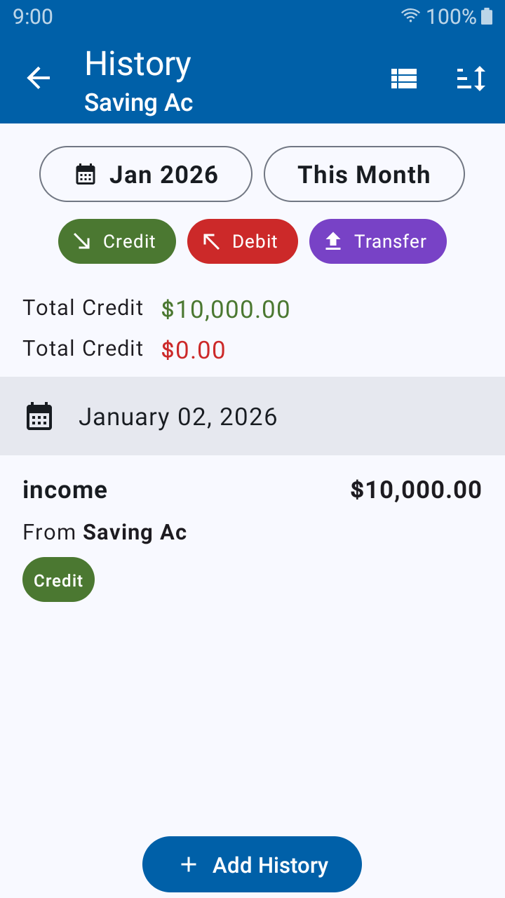
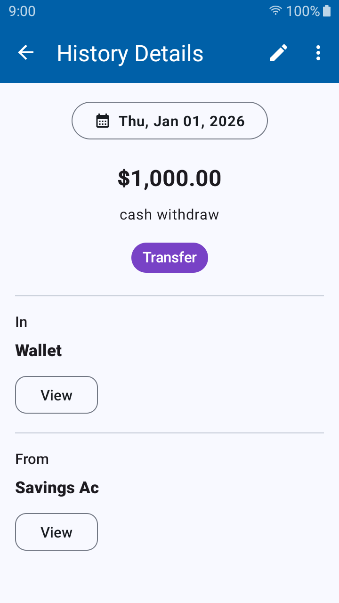
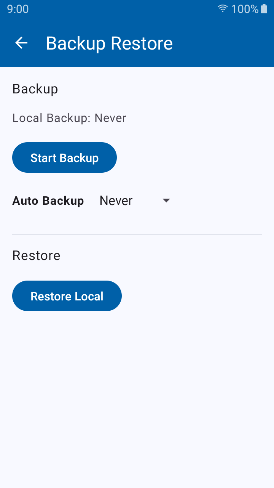

  

# Expense Tracker

A simple, clean, no-nonsense Android app for tracking daily credits, debits, balances, and groups. The app focuses on privacy (no networking), offline reliability, and smooth UX across modern Android versions.

## Screenshots

| Home                               | Accounts                             | Groups                             |
|------------------------------------|--------------------------------------|------------------------------------|
|  |  |  |

| Create History                               | Choose Account                        | Choose Group                        |
|----------------------------------------------|---------------------------------------|-------------------------------------|
|  |  |  |

| View Day History                             | View Month History                             | History Details                                 |
|----------------------------------------------|------------------------------------------------|-------------------------------------------------|
|  |  |  |

| Backup and Restore                    | Backup Frequency                                |
|---------------------------------------|-------------------------------------------------|
|  |  |

Browse all images [here](./screenshots). Do check a working example on [Youtube](https://youtu.be/59j8cjbDphY)

## ✨ Features

**Core**

* Track multiple **account balances**
* Add **credit**, **debit**, and **transfer** entries
* Create **groups** to organize transactions
* Local **backup & restore**
* **Automatic backup** using WorkManager
* Fully offline – **no network access**

**UI & Experience**

* Material 3 styling
* Smooth UI backed by state management with Kotlin Flow and SharedFlow
* Responsive layouts using ConstraintLayout + RecyclerView + CardView

## 🔧 Tech Stack

**Platform:** Ubuntu 24.04 LTS
**Android Studio:** Norwhal | Kotlin 2.0.21
**SDK:** Target 35, Min 26
**Tested On:**

* AVD Android 28, Android 34
* Physical Android 28

**Architecture:** MVVM
**Language:** Kotlin

**Android Jetpack:**

* LiveData
* ViewModel
* Room
* Navigation
* Data Binding
* WorkManager
* RecyclerView
* ConstraintLayout
* Paging3

**Async:** Coroutines + Flow
**DI:** None
**Testing:** JUnit

## 🧩 Technical Challenges & Solutions

**RecyclerView item selection**
Implemented a custom item-selection mechanism for predictable behavior across list updates.

**Automatic backup using WorkManager**
Set up periodic work with constraints and carefully handled SDK-level behavior differences.

**Storage access across Android versions**
Handled scoped storage and platform quirks for saving and restoring backup files reliably.

**UI state management with Kotlin Flow**
Used `SharedFlow` + sealed UI states (`UILoading`, `UISuccess`, `UIError`) for predictable and testable UI updates.

## 🚀 Upcoming Features (Next 2–3 Releases)

* Income & expense with categories
* Track and visualize earning and expenses
* Export history in pdf, excel, csv etc.
* Cloud backup + restore

## 📦 Important Links

**Email:** rahulstech18@gmail.com

**GitHub:** [Profile](https://github.com/rahulstech)

**LinkedIn:** [Profile](https://www.linkedin.com/in/rahul-bagchi-176a63212/)

